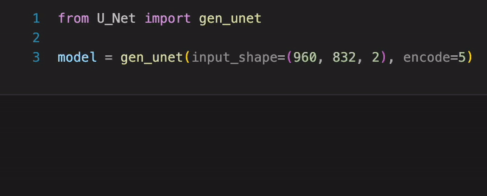
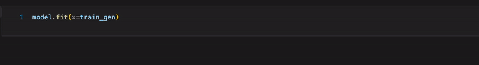

## Vocal isolation using U-Net architecture

  

image reference by :
[`[1]`](#1--jansson-andreas-et-al-singing-voice-separation-with-deep-u-net-convolutional-networks-2017)

## What you expect to do with this modeul

1. Generate your own dataset for training

  

2. Build U-Net architecture

  

3. Save your memory while training

  

4. Isolate multiple musics as vocal with once

  

## Module example with `Jupyter Notebook`
1. [`How to use utils`](./util_example.ipynb)
2. [`How to use models`](./model_example.ipynb)

## Module example with `Markdown`
1. [`How to use utils`](./util_example.md)
2. [`How to use models`](./model_example.md)

## Dependency

## Environment

## Contributors

## Reference

###### [`[1]`]() : [Jansson, Andreas, et al. "Singing voice separation with deep u-net convolutional networks." (2017).](https://ejhumphrey.com/assets/pdf/jansson2017singing.pdf)

###### [`[2]`]() : [Ronneberger, Olaf, Philipp Fischer, and Thomas Brox. "U-net: Convolutional networks for biomedical image segmentation." Medical Image Computing and Computer-Assisted Intervention–MICCAI 2015: 18th International Conference, Munich, Germany, October 5-9, 2015, Proceedings, Part III 18. Springer International Publishing, 2015.](https://arxiv.org/pdf/1505.04597.pdf)

## Dataset reference
###### [`[1]`]() : [Non-copyright background musics from `AShamaluevMusic`](https://www.ashamaluevmusic.com/no-copyright-music)

###### [`[2]`]() : [Kaggle - Common Voice dataset](https://www.kaggle.com/datasets/mozillaorg/common-voice)
