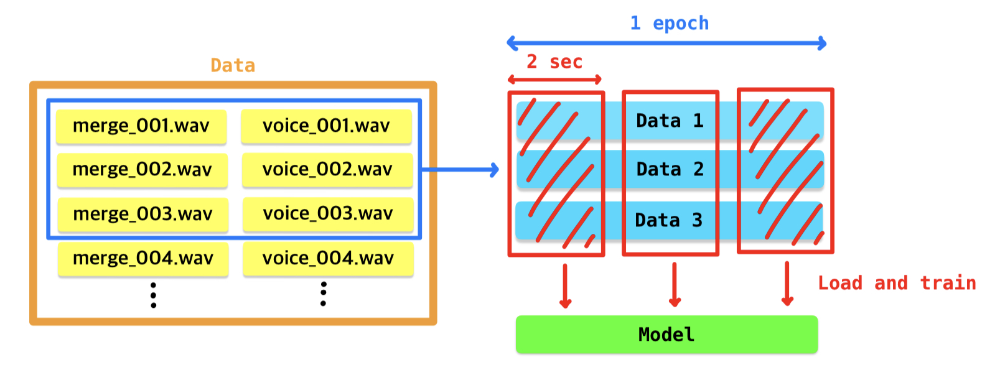

## How to use models in U_Net module

##### 1. [`gen_unet`](../U_Net/gen_unet.py)
- `gen_unet` function returns the deep learning model of U-Net architecture.

- The architecture was referenced by [singing voice separation with deep u-net convolutional networks](https://ejhumphrey.com/assets/pdf/jansson2017singing.pdf).


##### [`gen_unet`](../U_Net/gen_unet.py) arguments
```python
gen_unet(input_shape=(960, 832, 2), encode=5)
```

- The architecture we used, encodes the input image with 2 strides in convolution layer.
- The `encode` argument specify how many times to encode.
- Since we used 2 strides, the input shape must be the multiples of $2^{\ \textbf{encode} \ + \ 1}$.
- If not, the concate layer will raise error like below.

---
```python
>>> gen_unet(input_shape=(960, 832, 2), encode=5)
```
```
ValueError                                Traceback (most recent call last)
Cell In[1], line 3
      1 from U_Net import gen_unet
----> 3 gen_unet(input_shape=(960, 830, 2), encode=5)
```
$$\vdots$$
```
ValueError: A `Concatenate` layer requires inputs with matching shapes except for the concatenation axis. Received: input_shape=[(None, 480, 416, 32), (None, 480, 415, 32)]
```
---

- For example, if `encode=5`, the `input_shape` must be multiples of $2^{\ 5 \ + \  1} = 64$.
- So we can set the input shapes like `(960, 832, 2)`, `(768, 512)`.

$(960 \ \div 64 = 15), \ (832 \ \div 64 = 13), \ (768 \ \div 64 = 12), \ (512 \ \div 64 = 8),$

---

If you done properly, the shell output may like this.
```python
from U_Net import gen_unet

model = gen_unet(input_shape=(960, 832, 2), encode=5)

print("Total params: {:,}".format(model.count_params()))
```
```
Metal device set to: Apple M1 Pro

systemMemory: 16.00 GB
maxCacheSize: 5.33 GB

Total params: 52,404,242
```

You can see the architecture details running cell down below.

```python
from keras.utils import plot_model

model.summary()
plot_model(model, show_shapes=True)
```

---

##### 2. [`generators`](../U_Net/generators.py)
- Since we convert music files to image-like data, the memory usage may hit the ceiling and cause several issues.
- To avoid this, we made generators to save memory usage in every training step.

- There are 4 generators, `TrainGenerator`, `ValidGenerator`, `EvalGenerator`, `PredGenerator`. `PredGenerator` is for sake of `convert_pred` function. We'll describe it later.
- `TrainGenerator` was inherited by [`keras.utils.Sequence`](https://keras.io/ko/utils/#sequence), which is basic class for Generators.
- `ValidGenerator` and `EvalGenerator` were inherited by `TrainGenerator`, so basically `TrainGenerator`, `ValidGenerator` and `EvalGenerator` are same.

---

##### - [`TrainGenerator`](../U_Net/generators.py) arguments

```python
train_gen = TrainGenerator(
    src_path=train_path, input_pattern="merge*", output_pattern="voice*", 
    bulk_num=3,  sample_dur=2, 
    max_mem_size=2, restrict_mem=False, 
    n_fft=1918, win_length=1024, 
    sample_rate=110_000, shuffle=True
)
```

- The `src_path` is a path to import datasets.
- `input_pattern` and `output_pattern` specify the pattern of input-output data of model.
    - If `input_pattern=merge*`, the input data will be the files which contains `merge` in front of their names.
    - Also if `output_pattern=voice*`, the output data will be the files that contains `voice` in front of their names.

- `bulk_num` specify how many data to use in 1 epoch.
    -  If `bulk_num=3`, model will train 3 musics in parallel at every epoch.
- `sample_dur` determine the sample duration to train model in every steps. `sample_dur` can affect the input shape of model.
    - If `sample_dur=2.0`, `TrainGenerator` will load only 2 seconds in dataset, and try to train model.
    - For example, at first step, `TrainGenerator` loads 0 ~ 2 seconds of data. 
    - In second step, `TrainGenerator` loads 2 ~ 4 seconds of data and so on.

- `max_mem_size` refers the maximum usage (GB) of memory in every steps. 
- If `restric_mem=True` and exceed `max_mem_size`, raise `MemoryError`. If not, shows `ResourceWarning`

- `n_fft` refers the length of the windowed signal after padding with zeros. `n_fft` can affect the input shape of model.
- `win_length` refers the length of window in [STFT](https://en.wikipedia.org/wiki/Short-time_Fourier_transform) operation. `win_length` can affect the input shape of model.

- `TrainGenerator` will resolve musics with `sample_rate`. 
- If `shuffle=True`, `TrainGenerator` will shuffle the datasets.

To sum up, the image below shows how `TrainGenerator` works.

---
<p align="center">
  
</p>

---

The `TrainGenerator` can show the sample shape of single data, using `.input_shape`

```python
>>> train_gen.input_shape
(960, 832, 2)
```

You can build your own models using `.input_shape` property like below.


```python
from U_Net import gen_unet

model = gen_unet(train_gen.input_shape)

print(model.input_shape)
```
```
Metal device set to: Apple M1 Pro

systemMemory: 16.00 GB
maxCacheSize: 5.33 GB

(None, 960, 832, 2)
```

The `None` is a shape for batch size, so you don't need to bother with.

---
Once you made model, we recommand you to set loss function as `mae`. Then you can train your model with `TrainGenerator`.

```python
model.compile(optimizer="adam", loss="mae")
model.fit(x=train_gen, epochs=5, verbose=True)
```
```
Epoch 1/5
2023-07-29 19:21:48.869421: W tensorflow/tsl/platform/profile_utils/cpu_utils.cc:128] Failed to get CPU frequency: 0 Hz
94/94 [==============================] - 129s 1s/step - loss: 0.7784
Epoch 2/5
94/94 [==============================] - 124s 1s/step - loss: 0.7781
Epoch 3/5
94/94 [==============================] - 124s 1s/step - loss: 0.7715
Epoch 4/5
94/94 [==============================] - 125s 1s/step - loss: 0.7675
Epoch 5/5
94/94 [==============================] - 124s 1s/step - loss: 0.7604
```

---

##### 2. [`convert_pred`](../U_Net/convert_pred.py)
- After trained your model, you can use [`convert_pred`](../U_Net/convert_pred.py) function to check the prediction.

- [`convert_pred`](../U_Net/convert_pred.py) function uses `PredGenerator` to convert the prediction of model into wave file format, `.wav`

```python
from U_Net import convert_pred

src_path = "../Data/target_dir/test_data/"
pred_path = "../Data/less_trained_pred_sample/"

convert_pred(
    model=model, src_path=src_path, pred_dir=pred_path, pattern="merge*", 
    n_fft=1918, win_length=1024, sample_rate=110_000
)
```
```
Processing... [|] : [004/004]	 Done
```

##### - [`convert_pred`](../U_Net/convert_pred.py) arguments
- Use `model` to get prediction.
- The `src_path` is a path to import datasets.
- `pred_dir` is a directory to save model's prediction.
- `pattern` refers to which files in `src_path` to predict.
    - If `pattern=*.mp3`, `convert_pred` function will use every data in `src_path` includes `.mp3`

- `n_fft` refers the length of the windowed signal after padding with zeros.
- `win_length` refers the length of window in [STFT](https://en.wikipedia.org/wiki/Short-time_Fourier_transform) operation.
- `PredGenerator` will resolve datasets with `sample_rate`. We recommand to use same rates in training.

If you done correctly, `pred_dir` may look like this.

```zsh
$ cd ../Data/less_trained_pred_sample && tree
```

```zsh
.
├── merge_007.wav
├── merge_008.wav
├── merge_009.wav
└── merge_010.wav

1 directory, 4 files
```

Since we set the `pattern=merge*`, every file in `src_path` with named `merge...` was converted.

