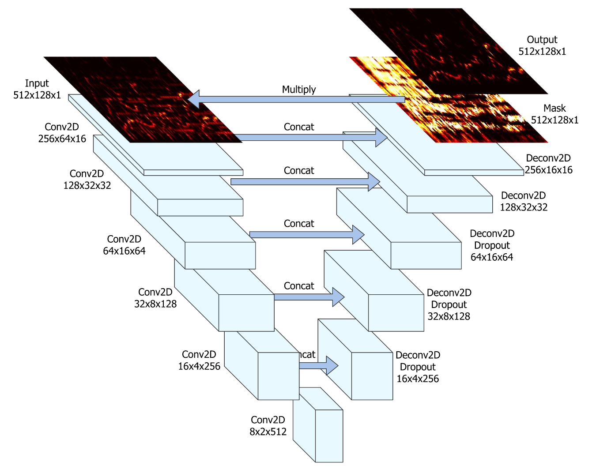

## Vocal isolation using U-Net architecture

  

image reference by :
[`[1]`](#1--jansson-andreas-et-al-singing-voice-separation-with-deep-u-net-convolutional-networks-2017)

### Download trained model by clicking [`here`](https://drive.google.com/file/d/1MKM8TxM3rqm-2QY-NGf9V_EhRStkPLdZ/view?usp=drive_web)

### Sample audio

<audio controls="controls">
  <source type="audio/wav" src="./Data/well_trained_pred_sample/merge_009.wav"></source>
  <source type="audio/ogg" src="./Data/well_trained_pred_sample/merge_009.wav"></source>
  
Your browser does not support the audio element.

</audio>

If audio player is not showing, you can check by clicking [`here`](./Data/well_trained_pred_sample/merge_009.wav).

---
### MATLAB AI challenge 2023 : Team CS

## Reference

###### [`[1]`]() : [Jansson, Andreas, et al. "Singing voice separation with deep u-net convolutional networks." (2017).](https://ejhumphrey.com/assets/pdf/jansson2017singing.pdf)

###### [`[2]`]() : [Ronneberger, Olaf, Philipp Fischer, and Thomas Brox. "U-net: Convolutional networks for biomedical image segmentation." Medical Image Computing and Computer-Assisted Intervention–MICCAI 2015: 18th International Conference, Munich, Germany, October 5-9, 2015, Proceedings, Part III 18. Springer International Publishing, 2015.](https://arxiv.org/pdf/1505.04597.pdf)

## Dataset reference
###### [`[1]`]() : [Non-copyright background musics from `AShamaluevMusic`](https://www.ashamaluevmusic.com/no-copyright-music)

###### [`[2]`]() : [Kaggle - Common Voice dataset](https://www.kaggle.com/datasets/mozillaorg/common-voice)
